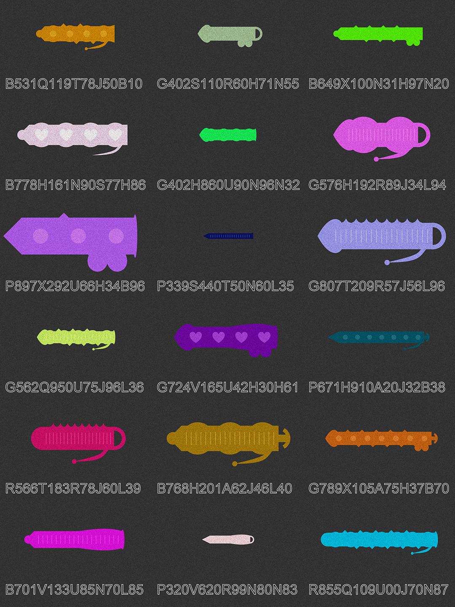
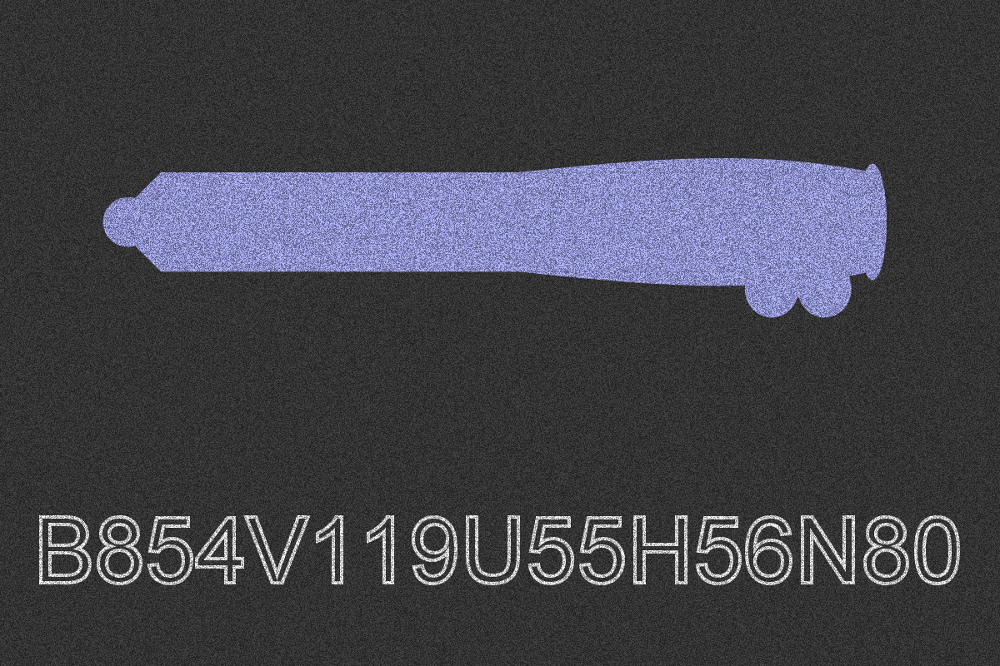
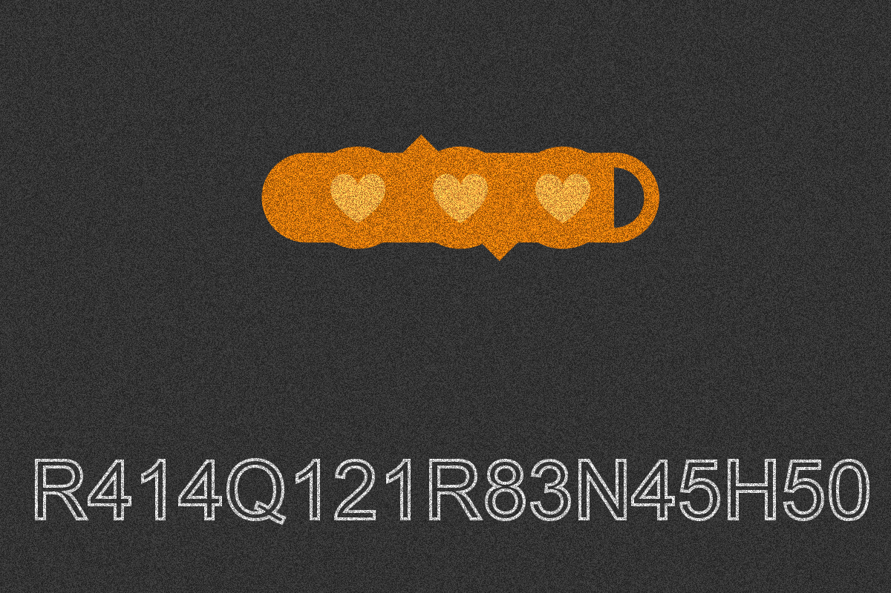
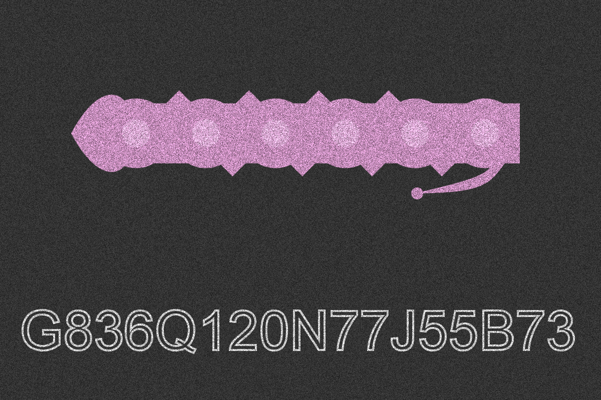
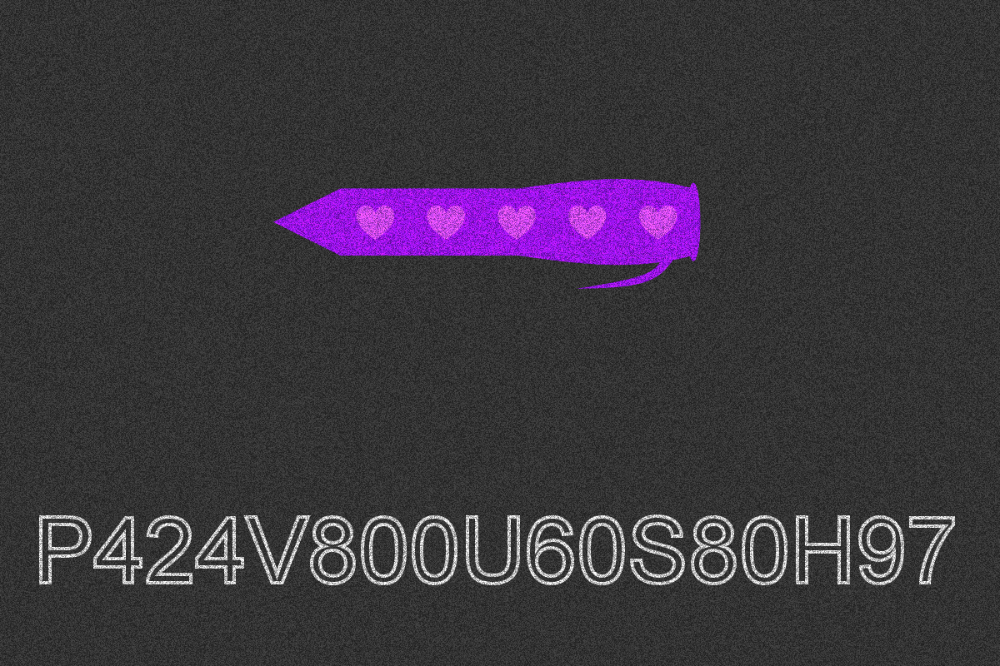

# CENNZnet Generative Art Bounty

_Submission for https://gitcoin.co/issue/cennznet/grants/9/100026471_

NFTs are growing hyper as more people get to know about them, but the pace of 
the growth is not even comparable to how Facebook or other web giants grew. 
If you ask me why, I'll reply "It's no fun." Many NFTs today don't create 
enough incentives for people to pay for them; they're boring. NFTs are meant
to be sent and received like money, but why the hell would I pay to send my
friend an ordinary image I could just send as an email. Personally, I won't
do it unless it's more than an ordinary image; it's funny, unique, and 
surprising...

## DeLdo NFT Art Generator

DeLdo, as the name suggests, is a dildo image generator with the aim of 
making NFTs funny and sexy. Next time you decide to have fun with your 
friends, try your luck and see whose is bigger :grin:.



Every dildo has a unique and searchable 16-character codename which can be
used to generate the exact same image again. All elements are customizable 
and combinable. They create endless possibilities of shape, size, and color. 
Check out the `Samples` folder for more images. Everything is created with
`pycairo`. Simple run `Generator.py` to get a new random DeLdo:

```
python3 Generator.py
```








